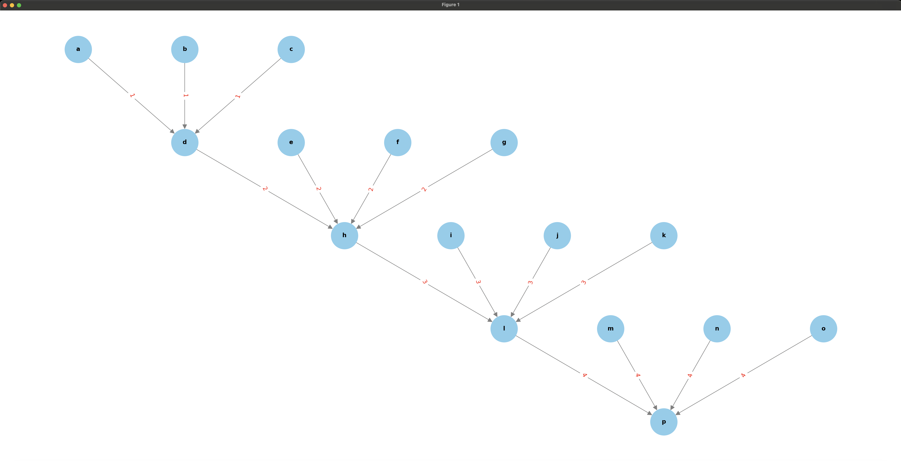
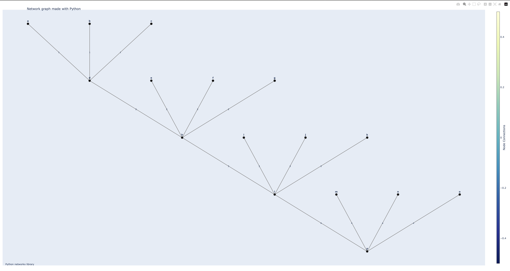

# Data Lineage Tracing Application

## Overview
This application traces the lineage of data tables using metadata from an Excel sheet and visualizes the dependency graph using either Matplotlib or Plotly. It includes functionalities to build the graph, draw it using different layouts, and annotate it with transformation IDs.

## Files
- **`get_metadata.py`**: Contains the function to extract metadata from an Excel sheet.
- **`trace_lineage.py`**: Main script to build the dependency graph, export it to JSON, and visualize it using either Matplotlib or Plotly.
- **`draw_plotly_with_annotation.py`**: Contains the function to draw the dependency graph using Plotly with annotations.
- **`save_to_atlas_json.py`**: Contains the function to export the dependency graph to Atlas JSON format.

## Installation
To run this application, you need the following Python packages. You can install them using the `requirements.txt` file:
```sh
pip install -r requirements.txt
```

You also need to install Graphviz:
- On Ubuntu:
  ```sh
  sudo apt-get install graphviz
  ```
- On macOS:
  ```sh
  brew install graphviz
  ```
- On Windows, download and install Graphviz from [here](https://graphviz.org/download/).

## Usage

### Step 1: Extract Metadata
Use the `get_metadata.py` script to extract metadata from an Excel sheet. The metadata includes source tables, target tables, and transformation IDs.

#### Example:
```python
from get_metadata import get_metadata_from_sheet

metadata = get_metadata_from_sheet('sample.xlsx', 'Sheet1')
```

### Step 2: Trace Lineage and Draw Graphs
Use the `trace_lineage.py` script to build the dependency graph, export it to JSON, and visualize it using either Matplotlib or Plotly.

#### Command-Line Usage:
```sh
python trace_lineage.py -i sample.xlsx -s Sheet1 -t p -o lineage.json -g matplotlib
```

or

```sh
python trace_lineage.py -i sample.xlsx -s Sheet1 -t p -o lineage.json -g plotly
```

## Example Workflow
1. Prepare an Excel file `sample.xlsx` with a sheet named `Sheet1` containing columns: `source_tables`, `target_table`, `transformation_id`.
2. Use `get_metadata.py` to extract metadata.
3. Use `trace_lineage.py` to build the dependency graph, export it to JSON, and visualize it using either Matplotlib or Plotly.

## Visual Example
Here is an example of a Matplotlib dependency graph:



Here is an example of a Plotly dependency graph:



## License
This project is licensed under the MIT License.

## Acknowledgements
- [NetworkX](https://networkx.github.io/)
- [Matplotlib](https://matplotlib.org/)
- [Plotly](https://plotly.com/)
- [OpenPyXL](https://openpyxl.readthedocs.io/en/stable/)
